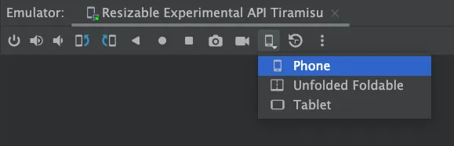
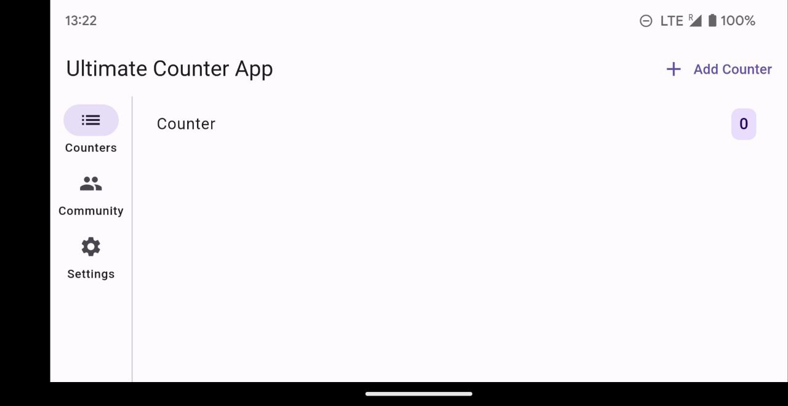
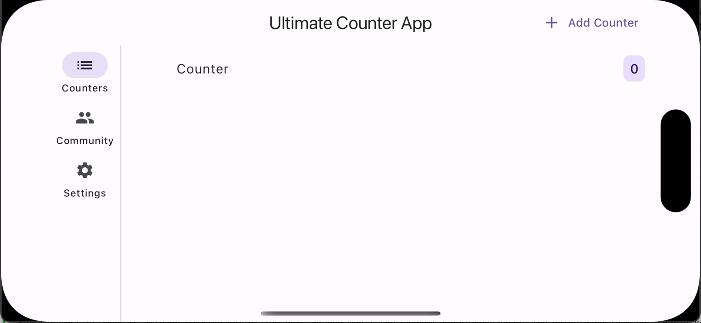

# Building Responsive UIs with Flutter

This repository aims to provide a solid foundation for developers looking to create responsive applications with Flutter. Dive into the concepts, explore the widgets, and experiment with the code to build apps that look great on any device.

**Side Note**: This guide sticks to the and avoiding additional packages. However, I recommend using a state management solution like Riverpod to manage your app's state effectively. To keep this example simple we will use the build in class `ChangeNotifier` to update the UI.


I also write on Medium and Dev.to, so if you prefer reading on those platforms, you can find the article here:
- [Medium](https://dario-digregorio.medium.com/building-responsive-uis-in-flutter-a-short-guide-db8edbeeb18e)
- [Dev.to](https://dev.to/dariodigregorio/building-responsive-uis-in-flutter-a-short-guide-5871)
  
If you have any questions, feedback, or suggestions, feel free to reach out to me [on X/Twitter](https://twitter.com/digregoriodario)

## Table of Contents
- [Building Responsive UIs with Flutter](#building-responsive-uis-with-flutter)
  - [Table of Contents](#table-of-contents)
  - [Introduction](#introduction)
  - [Setup and Key Insights](#setup-and-key-insights)
    - [Recommended Emulators/Simulators or Devices](#recommended-emulatorssimulators-or-devices)
    - [Your App doesn't support a Platform?](#your-app-doesnt-support-a-platform)
      - [Some more alternatives:](#some-more-alternatives)
  - [Foundation for Responsive Design](#foundation-for-responsive-design)
    - [Mobile First](#mobile-first)
    - [Screen-based Breakpoints](#screen-based-breakpoints)
    - [Device Segmentation](#device-segmentation)
    - [Style File](#style-file)
  - [Basic Layout](#basic-layout)
    - [Layout Foundation](#layout-foundation)
    - [Building the Responsive Layout](#building-the-responsive-layout)
    - [Adapting to Orientation Changes](#adapting-to-orientation-changes)
    - [Dialogs](#dialogs)
    - [Responsive Navigation](#responsive-navigation)
    - [Center ListView with whitespace](#center-listview-with-whitespace)
  - [Widgets](#widgets)
    - [Single](#single)
    - [Multi](#multi)
    - [Slivers](#slivers)
    - [Extras](#extras)
    - [Responsive Text](#responsive-text)
  - [Adapting to different devices and platforms](#adapting-to-different-devices-and-platforms)
    - [Notches and OS System Interfaces](#notches-and-os-system-interfaces)
      - [Android](#android)
      - [iOS](#ios)
  - [Orientation](#orientation)
    - [How Orientation gets retrieved](#how-orientation-gets-retrieved)
    - [Device Orientation](#device-orientation)
  - [Debugging](#debugging)
  - [Testing](#testing)
  - [Tips and Tricks](#tips-and-tricks)
    - [Adaptive vs Responsive (Copied from Flutter Docs)](#adaptive-vs-responsive-copied-from-flutter-docs)
      - [Responsive](#responsive)
      - [Adaptive](#adaptive)
    - [Helpful Libraries](#helpful-libraries)
    - [Use a State Management Library](#use-a-state-management-library)
    - [Design a Prototype first](#design-a-prototype-first)
    - [Hardcoded Sizes and Values](#hardcoded-sizes-and-values)
    - [Builder vs MediaQuery](#builder-vs-mediaquery)
  - [Conclusion](#conclusion)

## Introduction

Flutter's versatility allows developers to target a wide range of platforms including iOS, Android, Web, Desktop, and Linux. However, embracing this wide platform support introduces challenges such as:

- Handling different form factors and types: Phones, tablets, foldables, desktops, web interfaces, smartwatches, TVs, cars, smart displays, IoT, AR, VR, etc.
- Addressing notches, cutouts, punch holes.
- Scaling UI and text; ensuring accessibility.
- Supporting both RTL (Right-to-Left) and LTR (Left-to-Right) text directions and different type of fonts.

```
❓ Do you need to support all these devices?
It's important to understand your app's requirements and the target audience before diving into responsive design. Also consider the trade-offs and the additional effort required to support each platform. But with the right approach and setup you can build apps that look great on any device.
```

## Setup and Key Insights

Before diving into coding, setting up the right device and understanding key concepts are essential.

### Recommended Emulators/Simulators or Devices
Choose a device that you can test your app on:

| Environment               | HotReload |        Resizable Window         | Text Scaling | UI Scaling |
| ------------------------- | :-------: | :-----------------------------: | :----------: | :--------: |
| Windows/Mac/Linux         |    Yes    |               Yes               |     Yes      |    Yes     |
| Web                       |    No     |               Yes               |     Yes      |    Yes     |
| Android Emulator          |    Yes    | Experimental (only breakpoints) |     Yes      |    Yes     |
| iOS Simulator             |    Yes    |               No                |     Yes      |    Yes     |
| iPadOS (Stage Manager)    |    Yes    |             Limited             |     Yes      |    Yes     |
| MacOS (Designed for iPad) |    Yes    |               Yes               |      No      |     No     |

iPad Stage Manager:


Android Resizable Emulator:



### Your App doesn't support a Platform?
What If Your App Doesn't Support a Platform or you can not build on that platform?
Depending on the platform you are targeting, you might not be able to build or test your app on that platform. For example, if you are developing on Windows, you won't be able to build for iOS.

#### Some more alternatives:
- Use a cloud-based service like Codemagic, Bitrise, or GitHub Actions to build and test your app on different platforms.
- MacOS (Designed for iPad) or the iPadOS (Stage Manager) are great alternatives to test your iOS app as with a resizable window without building it nativly for MacOS.
- Use different physical devices to test your app on a platform you can't build for.

## Foundation for Responsive Design

### Mobile First 
Starting your design with mobile in mind makes scaling up to larger screens smoother. This approach helps in efficiently adapting your designs for tablets or desktops. One popular pattern is using a Master Detail interface to adapt your screens, which we will be implementing in this guide.

### Screen-based Breakpoints
First things first, we establish our breakpoints. These are key in determining how our app will flex and adapt to different screen sizes. What breakpoints you should use is up to you and your usecase of the app, but here's a common example:
``` dart
enum ScreenSize {
  small(300),
  normal(400),
  large(600),
  extraLarge(1200);

  final double size;

  const ScreenSize(this.size);
}

ScreenSize getScreenSize(BuildContext context) {
  double deviceWidth = MediaQuery.sizeOf(context).shortestSide;
  if (deviceWidth > ScreenSize.extraLarge.size) return ScreenSize.extraLarge;
  if (deviceWidth > ScreenSize.large.size) return ScreenSize.large;
  if (deviceWidth > ScreenSize.normal.size) return ScreenSize.normal;
  return ScreenSize.small;
}
```

### Device Segmentation
Categorize devices based on their form factor and type. This will help you understand the different types of devices, you need to support and how your app will adapt to them.
```dart
bool get isMobileDevice => !kIsWeb && (Platform.isIOS || Platform.isAndroid);
bool get isDesktopDevice =>
    !kIsWeb && (Platform.isMacOS || Platform.isWindows || Platform.isLinux);
bool get isMobileDeviceOrWeb => kIsWeb || isMobileDevice;
bool get isDesktopDeviceOrWeb => kIsWeb || isDesktopDevice;
```

### Style File
Having a style file with your app's colors, fonts, and text styles will help you maintain a consistent look and feel across your app. This will also help you in scaling your UI and text effectively when needed.

## Basic Layout
We’ll be enhancing the classic Counter App to showcase responsive design in Flutter. The goal is to manage multiple counters and introduce a `master-detail` interface for larger screens.

### Layout Foundation
We create a directory `pages` where we place all widgets which define a screen for a mobile device. Since we are using a Master-Detail design, we will define a `counters_page.dart` and a `counter_detail_page.dart`.

### Building the Responsive Layout
Now, onto the layout. We’re keeping things modular and adaptable, using [Dart Patterns](https://dart.dev/language/patterns) or more specificly [Switch Expressions](https://dart.dev/language/patterns#switch-statements-and-expressions) to easily switch layouts. Here’s how `app.dart` looks:
```dart
class _CounterAppState extends State<CounterApp> {
  // ...
  @override
  Widget build(BuildContext context) {
    final screenSize = getScreenSize(context);
    return Scaffold(
      bottomNavigationBar: switch (screenSize) {
        ScreenSize.normal || ScreenSize.small => const CounterNavigationBar(),
        _ => null,
      },
      body: switch (screenSize) {
          ScreenSize.large || ScreenSize.extraLarge => Row(
              children: [
                const CounterNavigationRail(),
                const VerticalDivider(thickness: 1, width: 1),
                Expanded(child: CountersPage(isPage: false)),
                Expanded(child: CounterDetailPage(isPage: false)),
              ],
            ),
          _ => CountersPage(isPage: true),
        },
      );
  }
}
```
Here, we’re using different navigation widgets based on the screen size — a NavigationBar for smaller screens and a NavigationRail for larger ones. Unfortunately it is a bit tricky using NavigationRail together with NavigationBar because Scaffold has only an input for a bottomNavigationBar. With the underscore we specify which layout should be shown on default.

Maybe you noticed the `isPage` flag. This flag is used for multiple purposes for example, to decide if the Counter Detail page should be pushed to the Navigation Stack or not.

### Adapting to Orientation Changes
What about when users flip their phones to landscape? Using Dart’s Record feature, we can elegantly handle multiple conditions, adapting our layout to both screen size and orientation. You can react to more variables by adding them to a Record.

```dart
class _CounterAppState extends State<CounterApp> {
  // ...
  @override
  Widget build(BuildContext context) {
    final screenSize = getScreenSize(context);
    final orientation = MediaQuery.orientationOf(context);
    return Scaffold(
      bottomNavigationBar: switch ((screenSize, orientation)) {
        (ScreenSize.normal || ScreenSize.small, Orientation.portrait) =>
          const CounterNavigationBar(),
        (_) => null,
      },
      body: switch ((screenSize, orientation)) {
          (ScreenSize.large || ScreenSize.extraLarge, _) => Row(
              children: [
                const CounterNavigationRail(),
                const VerticalDivider(thickness: 1, width: 1),
                Expanded(child: CountersPage(isPage: false)),
                Expanded(child: CounterDetailPage(isPage: false)),
              ],
            ),
          (_, Orientation.landscape) => Row(
              children: [
                const CounterNavigationRail(),
                const VerticalDivider(thickness: 1, width: 1),
                Expanded(child: CountersPage(isPage: true))
              ],
            ),
          (_) => CountersPage(isPage: true),
        },
      );
  }
}
```

### Dialogs
For a responsive UI, dialogs should adjust to screen size. In our example we want to display a fullscreen dialog on smaller screens and a dialog with dismissable background with constrained `maxWidth` on larger screens. We can use a similar approach as we did with the layout to achieve this. Here is how:
```dart
onPressed: () {
  showDialog(
    context: context,
    builder: (context) {
      if (screenSize == ScreenSize.large || screenSize == ScreenSize.extraLarge) {
        return Dialog(
          child: ConstrainedBox(
            constraints:
                BoxConstraints(maxWidth: ScreenSize.normal.size),
            child: const AddCounterDialog(),
          ),
        );
      }
      return const Dialog.fullscreen(
        child: AddCounterDialog(),
      );
  });
},
```

### Responsive Navigation
Consider a user navigating to the Counter Detail Screen on a small device. If the screen is resized to a larger dimension, the Counter Detail Screen remains due to direct navigation. To adapt to a larger layout, the Counter Detail Screen must be removed from the navigation stack when a resize to a bigger `ScreenSize` is being detected. This ensures the UI remains responsive to screen resizing. We implement this behavior as follows:
```dart
if (screenSize == ScreenSize.large || screenSize == ScreenSize.extraLarge) {
  SchedulerBinding.instance.addPostFrameCallback((_) {
    Navigator.of(context).popUntil((route) => route.isFirst);
  });
}
```
Wrap the `popUntil` method within a `SchedulerBinding.instance.addPostFrameCallback` to delay its execution until after the current build cycle to avoiding build method conflicts.

### Center ListView with whitespace
On larger screens, constraining the width of scrollable lists and centering them improves aesthetics and usability. Directly wrapping a `ListView` with a `ConstrainedBox` may restrict scrollable area to the constrained width, excluding the white space. A workaround involves using the `padding` parameter of `ListView` to dynamically calculate and apply horizontal padding based on screen size:
```dart
final width = MediaQuery.sizeOf(context).width;
double horizontalPadding = width > ScreenSize.large.size
      ? ((width - ScreenSize.large.size) / 2)
      : 16;
return Scaffold(
        body: ListView(
            padding: EdgeInsets.symmetric(
                horizontal: horizontalPadding, vertical: 16)
//...
));
```
This approach uses again the `ScreenSize` enum to remain consistent.

## Widgets
With our basic layout in place, it's time to explore the widgets that will enable us to construct a responsive UI. Flutter offers a rich set of widgets which are essential for creating responsive layouts and widgets. I strongly recommend reading documentation provided by the Flutter Team, which presents an extensive array of widgets in various formats. Here are some resources to get you started:
- **Flutter Docs:** 
  - [Adaptive Desgin - Layout Widgets](https://docs.flutter.dev/ui/layout/responsive/building-adaptive-apps#layout-widgets)
  - [Widget Catalog - Layout widgets](https://docs.flutter.dev/ui/widgets/layout)
  - [Youtube Flutter - Widget of the Week](https://www.youtube.com/playlist?list=PLjxrf2q8roU2HdJQDjJzOeO6J3FoFLWr2) Most of them are also showcased in the Flutter Widget of the Week series.


I will list a few important widgets that you should know when building a responsive app. Some are copied from the Flutter documentation and some are my own recommendations:
### Single
 - [Align](https://api.flutter.dev/flutter/widgets/Align-class.html) a child within itself. It takes a double value between -1 and 1, for both the vertical and horizontal alignment.
- [AspectRatio](https://api.flutter.dev/flutter/widgets/AspectRatio-class.html) Attempts to size the child to a specific aspect ratio.
- [ConstrainedBox](https://api.flutter.dev/flutter/widgets/ConstrainedBox-class.html) Imposes size constraints on its child, offering control over the minimum or maximum size.
- [CustomSingleChildLayout](https://api.flutter.dev/flutter/widgets/CustomSingleChildLayout-class.html) Uses a delegate function to position a single child. The delegate can determine the layout constraints and positioning for the child.
- [Expanded](https://api.flutter.dev/flutter/widgets/Expanded-class.html) and [Flexible](https://api.flutter.dev/flutter/widgets/Flexible-class.html) Allows a child of a Row or Column to shrink or grow to fill any available space.
- [FractionallySizedBox](https://api.flutter.dev/flutter/widgets/FractionallySizedBox-class.html) Sizes its child to a fraction of the available space.
- [LayoutBuilder](https://api.flutter.dev/flutter/widgets/LayoutBuilder-class.html) Builds a widget that can reflow itself based on its parents size.
- [SingleChildScrollView](https://api.flutter.dev/flutter/widgets/SingleChildScrollView-class.html) Adds scrolling to a single child. Often used with a Row or Column.
### Multi
- [Column](https://api.flutter.dev/flutter/widgets/Column-class.html), [Row](https://api.flutter.dev/flutter/widgets/Row-class.html), [Flex](https://api.flutter.dev/flutter/widgets/Flex-class.html) Lays out children in a single horizontal or vertical run. Both Column and Row extend the Flex widget.
- [CustomMultiChildLayout](https://api.flutter.dev/flutter/widgets/CustomMultiChildLayout-class.html)Uses a delegate function to position multiple children during the layout phase.
- [Flow](https://api.flutter.dev/flutter/widgets/Flow-class.html) Similar to CustomMultiChildLayout, but more efficient because it’s performed during the paint phase rather than the layout phase.
- [ListView](https://api.flutter.dev/flutter/widgets/ListView-class.html), [GridView](https://api.flutter.dev/flutter/widgets/GridView-class.html) and [CustomScrollView](https://api.flutter.dev/flutter/widgets/CustomScrollView-class.html) Provides scrollable lists of children
- [Stack](https://api.flutter.dev/flutter/widgets/Stack-class.html) Layers and positions multiple children relative to the edges of the Stack. Functions similarly to position-fixed in CSS.
- [Table](https://api.flutter.dev/flutter/widgets/Table-class.html) Uses a classic table layout algorithm for its children, combining multiple rows and columns.
- [Wrap](https://api.flutter.dev/flutter/widgets/Wrap-class.html) Displays its children in multiple horizontal or vertical runs.

### Slivers
Slivers are a whole different topic, which I won't cover in this guide. But they are essential for building complex and responsive scrollable layouts. I will cover them in the future more extensively. Here are some important Sliver Widgets:
- [CustomScrollView](https://api.flutter.dev/flutter/widgets/CustomScrollView-class.html) A ScrollView that creates custom scroll effects using slivers.
- [NestedScrollView](https://api.flutter.dev/flutter/widgets/NestedScrollView-class.html) A ScrollView that creates custom scroll effects using slivers, with a flexible header and body.
- [SliverCrossAxisGroup](https://api.flutter.dev/flutter/widgets/SliverCrossAxisGroup-class.html) A sliver that lays out multiple box children in a cross-axis group.
- [SliverFillRemaining](https://api.flutter.dev/flutter/widgets/SliverFillRemaining-class.html) A sliver that fills the remaining space in the viewport.
- [SliverFillViewport](https://api.flutter.dev/flutter/widgets/SliverFillViewport-class.html) A sliver that fills the viewport with a single box child, regardless of the child's dimensions.
- [SliverPadding](https://api.flutter.dev/flutter/widgets/SliverPadding-class.html) A sliver that adds padding to its sliver child.
- [sliver_tools](https://pub.dev/packages/sliver_tools) A package that provides a set of sliver tools that Flutter currently lacks.

### Extras
- [SafeArea](https://api.flutter.dev/flutter/widgets/SafeArea-class.html) Creates a widget that avoids system intrusions.
- [Spacer](https://api.flutter.dev/flutter/widgets/Spacer-class.html) A widget that takes up space proportional to the space between its siblings.
- [SizedBox](https://api.flutter.dev/flutter/widgets/SizedBox-class.html) A box with a specified size. I often use it to add space between widgets.


and many more...

### Responsive Text
Text are often the cause for overflowing Layouts especially when using small devices. Here are some tips to make your text responsive:
- Use the `overflow` property of the Text widget to handle overflow.
- Wrap your Text widget with a `Flexible` or `Expanded` widget to make it responsive.
- Set the `softWrap` property to false to prevent the text from wrapping
- Keep in mind that many OSs have accessibility features to scale the font size dynamically so Text can easily overflow

## Adapting to different devices and platforms
Building apps with Flutter allows you to use a single codebase for multiple platforms. However, adapting to the nuances of different devices and operating systems is crucial for a polished user experience. Here are some tips to ensure your app looks the same on all platforms.

### Notches and OS System Interfaces
Flutter's support extends to a variety of platforms, each with its own handling of notches and system interfaces. The key differences lie between Android and iOS, which we'll explore below.

#### Android
By default, Flutter apps on Android display a black background behind the navigation pill, and when in landscape mode, a black bar appears if the phone has a notch. To modernize the look and eliminate these black bars:

In your root widget's `initState()` method, add:
```dart
   SystemChrome.setEnabledSystemUIMode(SystemUiMode.edgeToEdge);
```
This adjustment extends ListView and bottomNavigationBar to fill the screen, including behind the navigation pill. Avoid using SafeArea if you aim for a fully expanded view.

To address the landscape mode's black bar behind the notch, modify your Android project's main styles.xml file:
```dart
// ...
<resources>
    <style>
      <item name="android:windowLayoutInDisplayCutoutMode">shortEdges</item> 
// ...
```

To ensure system interfaces do not obstruct your app's UI on older devices, add:
```dart
    SystemChrome.setSystemUIOverlayStyle(const SystemUiOverlayStyle(
      statusBarColor: Colors.transparent,
      systemNavigationBarColor: Colors.transparent,
    ));
```
With these tweaks, your app will offer an uninterrupted UI experience on Android devices.

#### iOS
iOS devices generally handle notches and system interfaces out of the box, requiring no specific alterations as mentioned for Android. However, when using iOS in landscape mode, note that padding for the notch is symmetrically applied to both sides of the screen, a design requirement by iOS that can't be easily overridden.


## Orientation

### How Orientation gets retrieved
The orientation of the device can be determined using `MediaQuery.orientationOf(context)`. On mobile devices equipped with a gyroscope, orientation is directly obtained. In contrast, for desktops or web platforms lacking a gyroscope, orientation is inferred from the screen dimensions: `Orientation.portrait` if the height exceeds the width, and `Orientation.landscape` otherwise.

### Device Orientation
To lock or set specific orientations for your app, include the following in your root widget's `initState`
```dart
 SystemChrome.setPreferredOrientations([
      DeviceOrientation.portraitUp,
      DeviceOrientation.portraitDown,
      DeviceOrientation.landscapeLeft,
      DeviceOrientation.landscapeRight,
    ]);
```
For Apple devices, additional configuration in Xcode is required. Navigate to your project's settings under Project Runner > Target Runner > Deployment Info and select the appropriate orientation boxes.

## Debugging
To effectively debug your layouts, use the Widget Inspector in DevTools. This tool allows you to thoroughly inspect each widget and its properties, understanding how it adjusts within your layout. Here are a few key features:

- **Select Widget Mode**: This feature enables you to interact directly with your app's UI. Simply click on a widget in the UI, and it will be highlighted in the Inspector and the UI. It also jumps to the code, where the widget is implemented. This immediate feedback loop is invaluable for pinpointing how specific widgets are rendered and behave in your layout.

- **Layout Explorer**: For an in-depth analysis, the Layout Explorer reveals how the selected widget fits into your layout. It's especially useful for visualizing and tweaking widget properties on the fly.

- **Widget Details Tree**: Dive deeper into the widget's structure with the Widget Details Tree. This view exposes the internal composition of a widget, including the widgets it utilizes internally and their respective properties.

- **Flex Properties**: When selecting a Flex widget (such as a Row or Column), you have the ability to manipulate its Flex Properties and of the children. This feature lets you experiment with different property values to see real-time changes and understand how the widgets adapts.

- **Show Guidelines**: Visualize the overall layout structure of your app with the Show Guidelines Button. It helps identify how widgets align with each other and where Scrollable widgets are, providing a clearer understanding of the layout's architecture.

By integrating these tools and features into your development workflow, you can significantly enhance the debugging process of your Flutter layouts.


## Testing
Testing your app on different screen sizes is crucial to ensure a consistent user experience. Here’s how you can do it:
``` dart
  group('Test Responsive', () {
    testWidgets('should have only CountersPage', (WidgetTester tester) async {
      tester.view.devicePixelRatio = 1.0; // Set to 1.0 have use a specific size
      tester.view.physicalSize =
          const Size(500, 800); // to test layout on smaller devices
      await tester.pumpWidget(const CounterApp());
      // Test if only CountersPage is shown
      expect(find.byType(CountersPage), findsOneWidget);
      expect(find.byType(CounterDetailPage), findsNothing);
    });

    testWidgets('should have CountersPage and Detail',
        (WidgetTester tester) async {
      tester.view.devicePixelRatio = 1.0;
      tester.view.physicalSize =
          const Size(800, 1200); // to test layout on larger devices
      await tester.pumpWidget(const CounterApp());
      // Test if both pages are shown
      expect(find.byType(CountersPage), findsOneWidget);
      expect(find.byType(CounterDetailPage), findsOneWidget);
    });
  });
```

## Tips and Tricks
Here are some tips, tricks, and misconceptions that you should keep in mind when building responsive apps.

### Adaptive vs Responsive (Copied from [Flutter Docs](https://docs.flutter.dev/ui/layout/responsive/adaptive-responsive#the-difference-between-an-adaptive-and-a-responsive-app))

#### Responsive
Typically, a responsive app has had its layout tuned for the available screen size. Often this means (for example), re-laying out the UI if the user resizes the window, or changes the device’s orientation. This is especially necessary when the same app can run on a variety of devices, from a watch, phone, tablet, to a laptop or desktop computer.
#### Adaptive
Adapting an app to run on different device types, such as mobile and desktop, requires dealing with mouse and keyboard input, as well as touch input. It also means there are different expectations about the app’s visual density, how component selection works (cascading menus vs bottom sheets, for example), using platform-specific features (such as top-level windows), and more.

There is a great article from Craig Labenz about adaptive Design: [How Google Earth supports every use case on earth](https://medium.com/flutter/extreme-ui-adaptability-in-flutter-how-google-earth-supports-every-use-case-on-earth-6db4661e7a17).

### Helpful Libraries
Here are some libraries that can help you build responsive apps. I couldn't try them out yet extensively, but they look promising:

- [flutter_adaptive_scaffold](https://pub.dev/packages/flutter_adaptive_scaffold): A Flutter package that provides adaptive/responsive scaffold widgets for different platforms.
- [device_preview](https://pub.dev/packages/device_preview): A Flutter package that allows you to preview your app on different devices and test your responsive UI.
- [wolt_modal_sheet](https://pub.dev/packages/wolt_modal_sheet): A Flutter package that provides a responsive modal sheet widget.

### Use a State Management Library
Using a state management library like Riverpod, Provider, or Bloc can help you manage your app's state effectively. This will help you in managing your app's state across different screen sizes and devices. It will also help you in testing your app.
See my other [Repository](https://github.com/dario-digregorio/flutter_responsive) to know how to use Riverpod in our Counter App.

### Design a Prototype first
Using Tools like Figma can help you in designing your app for different screen sizes and devices. It will also help you in understanding how your app will look on different devices. Iterating on your design will help you and save you a lot of time.

### Hardcoded Sizes and Values
Avoid relying on hardcoded sizes and values within your app, as they frequently lead to UI overflow issues. If the use of hardcoded values is unavoidable, ensure that your widgets, such as `Text` widgets, can overflow rightfully. Refer to the dedicated section in this guide for more details on managing overflow with `Text` widgets.

Additionally, consider utilizing ConstrainedBox to introduce a degree of flexibility to your widgets. This approach allows you to set minimum and maximum constraints, providing your layout with the adaptability it needs to accommodate different screen sizes and orientations without compromising on design integrity.

### Builder vs MediaQuery
Using `LayoutBuilder` and `OrientationBuilder` can sometimes get a bit hacky to use especially when using them in combination or for complex layouts. That is why I prefer to use `MediaQuery`. 

⚠️**Warning** Thre are few things you should keep in mind when using MediaQuery:
- `MediaQuery` comes with different methods like `sizeOf` or `orientationOf` which you should use instead of `MediaQuery.of(context).size` or `MediaQuery.of(context).orientation`. The reason you only want automatic rebuilds whenever that specific property changes.
- Using `MediaQuery` can have unwanted rebuilds. So make sure to only use it in a parent widget to define the whole Layout.

## Conclusion
Our app now dynamically responds to every screen size. The beauty of Flutter is that it provides all the tools necessary for responsive design across any device.

Keen to see these methods in action? Check out my app, **Yawa: Weather & Radar**, on [Android](https://play.google.com/store/apps/details?id=de.digregorio.dario.yawa) and [iOS](https://apps.apple.com/de/app/yawa-weather-forecast/id1626828365).


 And if you have any questions or feedback, feel free to reach out on [Twitter](https://twitter.com/digregoriodario)!
